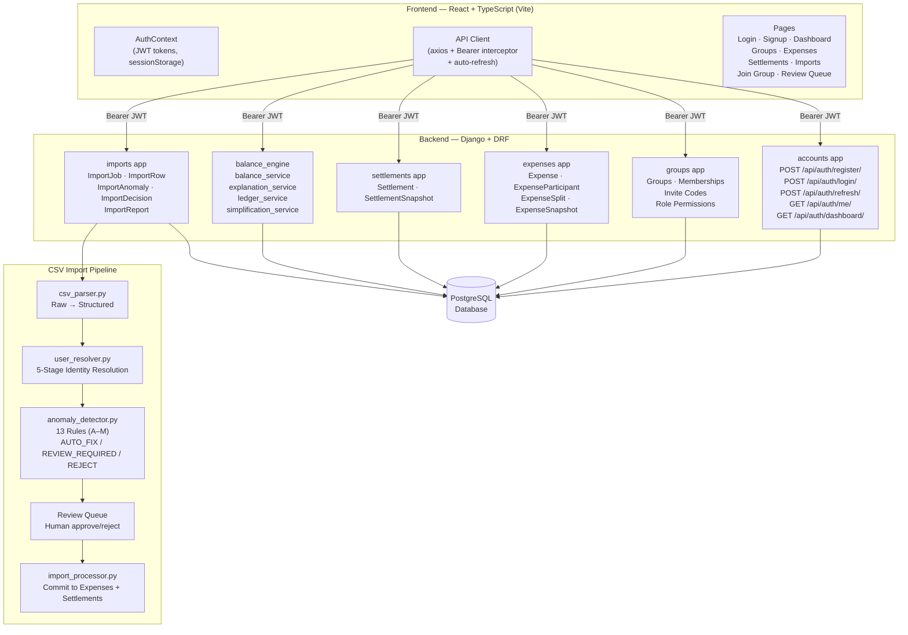

# Spreewise — Shared Expense Management Platform

> A production-grade, multi-user SaaS platform for tracking shared expenses, computing membership-aware balances, and importing historical expense data with intelligent anomaly detection.

---

## Table of Contents

1. [Project Overview](#project-overview)
2. [Key Features](#key-features)
3. [Technology Stack](#technology-stack)
4. [Architecture Diagram](#architecture-diagram)
5. [Setup Instructions](#setup-instructions)
6. [Running the Verification Suites](#running-the-verification-suites)
7. [API Overview](#api-overview)
8. [Project Structure](#project-structure)

---

## Project Overview

### What is Spreewise?

Spreewise is a shared expense management platform for roommates, travel groups, and teams. It tracks who paid what, computes how much each person owes, and generates the minimum number of payment instructions to fully settle all debts.

### What Problem Does It Solve?

When groups of people share expenses over time — rent, groceries, travel — tracking "who owes whom" manually becomes error-prone. Spreewise automates this by:

- **Recording expenses** with 4 flexible split types (equal, percentage, shares, exact)
- **Tracking membership timelines** so historical expenses are only attributed to members who were active on that date
- **Computing net balances** per member using a normalized ledger that walks expenses and settlements chronologically
- **Simplifying debts** using a greedy algorithm that reduces N-way debts into the minimum payment graph
- **Importing CSV data** from external sources with 13 anomaly detection rules and a human-in-the-loop review workflow
- **Enforcing multi-user access control** so each user only sees groups they belong to

---

## Key Features

### Authentication
- JWT-based authentication using `djangorestframework-simplejwt`
- Registration with username, email, full name, and password validation
- Automatic token refresh — expired access tokens are silently refreshed using the refresh token
- Session-scoped token storage (`sessionStorage`, never `localStorage`)
- Role-based permission enforcement (Owner / Admin / Member)

### Groups & Membership
- Create groups with a name, description, and currency
- Automatic `owner` role for group creator
- Invite code system — every group gets a unique `SPW-XXXXXXXX` code
- Members join by entering the invite code at `/join-group`
- **Historical membership tracking** — `joined_at` and `left_at` dates are stored, enabling accurate per-date membership validation

### Membership Lifecycle
- Members can leave and rejoin groups (re-join date must be after the previous leave date)
- Expenses are validated against membership at the time of the expense date
- Admins can add/remove members; only owners can archive groups

### Expense Engine
- 4 split types: `equal`, `percentage`, `shares`, `exact`
- Original amounts preserved alongside group-currency amounts for full auditability
- Immutable `ExpenseSnapshot` versions created on every create/update
- Soft delete (expenses are archived, not destroyed)
- Source tracking: `manual`, `csv_import`, or `system`

### Settlement Engine
- Standalone settlement model with unique `reference_id`
- Payer → Receiver direction with amount and payment category (UPI, cash, bank transfer, etc.)
- Original currency preserved alongside group currency
- Immutable `SettlementSnapshot` on every create/update
- Import-traceable: each settlement can reference the `ImportJob` that created it

### Balance Engine
- **Normalized ledger**: walks all expenses and settlements chronologically
- **Debt simplification**: greedy algorithm that reduces N-way debts into the minimum set of payments
- **User explanation**: per-user breakdown of what they paid, their share, and their net position
- Balances computed on-demand (not cached in DB) ensuring always-accurate results

### CSV Import Engine
- Upload CSV files mapped to a specific group
- Multi-stage parsing: raw → partial parse → full parse
- **User Resolution Layer**: 5-stage identity matching (username → first name → full name → prefix → alias)
- 13 anomaly detection rules (see SCOPE.md for full catalog)
- Three policy types: `AUTO_FIX`, `REVIEW_REQUIRED`, `REJECT`
- Human review queue: approve/reject anomalies individually before finalizing import
- Full `ImportReport` generated after completion

### Personalized Dashboard
- Cross-group summary: You Owe / You Are Owed / Net Balance
- Recent expenses and settlements from all your groups
- Pending import review count with direct link to review queue
- Per-group analytics: monthly expense timeline, category breakdown pie chart

### Security
- All querysets scoped to authenticated user's group memberships
- Balance endpoints require active group membership (returns 403 if not a member)
- CSV upload requires `owner` or `admin` role
- User A cannot access User B's data via URL manipulation

---

## Technology Stack

| Layer | Technology |
|---|---|
| **Backend Framework** | Django 6.0.6 |
| **REST API** | Django REST Framework 3.17.1 |
| **Authentication** | djangorestframework-simplejwt 5.5.1 |
| **Database** | PostgreSQL (via psycopg2-binary) |
| **Frontend Framework** | React 18 + TypeScript (Vite) |
| **State Management** | React Query (@tanstack/react-query) |
| **Form Validation** | React Hook Form + Zod |
| **UI Components** | Custom components + Lucide React icons |
| **Charts** | Recharts |
| **Styling** | Tailwind CSS |
| **CORS** | django-cors-headers |
| **Environment** | python-dotenv |

---

## Architecture Diagram



---

## Setup Instructions

### Prerequisites
- Python 3.11+
- Node.js 18+
- PostgreSQL 14+

### 1. Clone the Repository

```bash
git clone https://github.com/SalilkumarMishra/spreewise.git
cd spreewise/shared-expense-app
```

### 2. Backend Setup

```bash
cd backend

# Create and activate virtual environment
python -m venv venv
venv\Scripts\activate        # Windows
# source venv/bin/activate   # Linux/macOS

# Install dependencies
pip install -r requirements.txt
```

### 3. Database Setup

Create a PostgreSQL database:
```sql
CREATE DATABASE spreewise;
CREATE USER spreewise_user WITH PASSWORD 'your_password';
GRANT ALL PRIVILEGES ON DATABASE spreewise TO spreewise_user;
```

### 4. Environment Variables

Create `backend/.env`:
```env
SECRET_KEY=your-django-secret-key-here
DEBUG=True
DB_NAME=spreewise
DB_USER=spreewise_user
DB_PASSWORD=your_password
DB_HOST=localhost
DB_PORT=5432
```

### 5. Run Migrations & Start Backend

```bash
cd backend
python manage.py migrate
python manage.py createsuperuser  # optional — for admin panel
python manage.py runserver
```

Backend runs at: **http://127.0.0.1:8000**

Admin panel: **http://127.0.0.1:8000/admin**

### 6. Frontend Setup

```bash
cd frontend
npm install
npm run dev
```

Frontend runs at: **http://localhost:5173**

---

## Running the Verification Suites

All scripts run from the `backend/` directory with the virtual environment active.

```bash
cd shared-expense-app/backend
```

### JWT Authentication Suite (34 tests)
```bash
python verify_jwt_auth.py
```
Tests: Registration → Login → Token Refresh → /me/ → Group + Invite Code → Second User Join → Visibility → Unauthorized Rejection → User Search → Dashboard → Logout

### User Resolution Suite
```bash
python verify_user_resolution.py
```
Tests: Case-insensitive matching, whitespace normalization, first-name matching, full-name matching, prefix matching

### Django Unit Tests
```bash
python manage.py test --verbosity=2
```

---

## API Overview

All endpoints require `Authorization: Bearer <access_token>` unless marked **Public**.

### Auth Endpoints

| Method | Endpoint | Auth | Description |
|---|---|---|---|
| POST | `/api/auth/register/` | Public | Register — returns user + tokens |
| POST | `/api/auth/login/` | Public | Login — returns tokens |
| POST | `/api/auth/refresh/` | Public | Refresh access token |
| POST | `/api/auth/logout/` | JWT | Logout |
| GET | `/api/auth/me/` | JWT | Current user profile |
| GET | `/api/auth/dashboard/` | JWT | Personalized cross-group summary |
| GET | `/api/users/search/?q=` | JWT | Search users by name/email |

### Groups

| Method | Endpoint | Description |
|---|---|---|
| GET | `/api/groups/` | List my groups (membership-scoped) |
| POST | `/api/groups/` | Create group (creator becomes owner) |
| GET | `/api/groups/{id}/` | Group detail with members |
| PATCH | `/api/groups/{id}/` | Update group (owner/admin) |
| DELETE | `/api/groups/{id}/` | Soft archive (owner only) |
| POST | `/api/groups/join/` | Join via invite code |
| GET | `/api/groups/{id}/members/` | List members |
| POST | `/api/groups/{id}/members/` | Add member (owner/admin) |
| POST | `/api/groups/{id}/members/{mid}/leave/` | Leave group |
| DELETE | `/api/groups/{id}/members/{mid}/remove/` | Remove member (owner/admin) |
| POST | `/api/groups/{id}/members/{mid}/role/` | Change role (owner only) |

### Expenses

| Method | Endpoint | Description |
|---|---|---|
| GET | `/api/expenses/?group_id=` | List expenses (membership-scoped) |
| POST | `/api/expenses/` | Create expense |
| GET | `/api/expenses/{id}/` | Expense detail with splits |
| PATCH | `/api/expenses/{id}/` | Update expense |
| DELETE | `/api/expenses/{id}/` | Soft archive |

### Settlements

| Method | Endpoint | Description |
|---|---|---|
| GET | `/api/settlements/?group_id=` | List settlements (membership-scoped) |
| POST | `/api/settlements/` | Create settlement |
| GET | `/api/settlements/{id}/` | Settlement detail |
| PATCH | `/api/settlements/{id}/` | Update settlement |
| DELETE | `/api/settlements/{id}/` | Soft archive |

### Balances

| Method | Endpoint | Description |
|---|---|---|
| GET | `/api/balances/groups/{gid}/` | Group balance summary |
| GET | `/api/balances/groups/{gid}/simplified/` | Minimum payment instructions |
| GET | `/api/balances/groups/{gid}/users/{uid}/` | Per-user balance explanation |
| GET | `/api/balances/groups/{gid}/ledger/` | Chronological ledger |

### Imports

| Method | Endpoint | Description |
|---|---|---|
| POST | `/api/imports/upload/` | Upload CSV (owner/admin only) |
| GET | `/api/imports/` | List my import jobs |
| GET | `/api/imports/{id}/` | Import job detail |
| GET | `/api/imports/{id}/anomalies/` | List anomalies |
| POST | `/api/imports/{id}/decide/` | Submit anomaly decisions |
| POST | `/api/imports/{id}/commit/` | Commit approved rows |
| GET | `/api/imports/{id}/report/` | Final import report |

---

## Project Structure

```
spreewise/
├── shared-expense-app/
│   ├── backend/
│   │   ├── accounts/           # JWT auth, registration, user search
│   │   ├── balance_engine/     # Balance, ledger, simplification services
│   │   ├── config/             # Django settings, URLs
│   │   ├── expenses/           # Expense, Participant, Split, Snapshot models
│   │   ├── groups/             # Group, Membership, invite codes, roles
│   │   ├── imports/            # CSV pipeline: parser, resolver, anomalies, processor
│   │   ├── settlements/        # Settlement, Snapshot models
│   │   └── verify_jwt_auth.py  # End-to-end JWT verification suite
│   └── frontend/
│       └── src/
│           ├── api/            # Client, auth, groups, expenses, dashboard
│           ├── components/     # Reusable UI components
│           ├── context/        # AuthContext (JWT state)
│           ├── layouts/        # ProtectedLayout (sidebar, header)
│           └── pages/          # Login, Signup, Dashboard, Groups, etc.
├── README.md
├── SCOPE.md
├── DECISIONS.md
├── AI_USAGE.md
└── TESTING_GUIDE.md
```

## Demo Environment & Interview Walkthrough

### Demo Login Credentials

All demo accounts use the same password:

```text
Password: Demo@123
```

| Username | Role |
| -------- | ---- |
| aisha    | Group Owner |
| rohan    | Member |
| priya    | Member |
| meera    | Former Member |
| sam      | New Member |
| dev      | Temporary Trip Member |

---

### Demo Group

```text
Flatmates Shared Expenses
```

Currency:

```text
INR
```

The group contains historical membership changes that demonstrate membership‑aware expense tracking.

---

### Membership Timeline

#### Aisha

Joined:
2026-02-01

Status:
Active

---

#### Rohan

Joined:
2026-02-01

Status:
Active

---

#### Priya

Joined:
2026-02-01

Status:
Active

---

#### Meera

Joined:
2026-02-01

Left:
2026-03-31

Status:
Inactive

---

#### Sam

Joined:
2026-04-15

Status:
Active

---

#### Dev

Joined:
2026-02-08

Left:
2026-03-15

Purpose:
Temporary Goa Trip Member

---

### Included Demo Scenarios

The demo dataset intentionally covers every major feature of the platform.

#### Expenses

Examples include:

* Equal split expenses
* Percentage split expenses
* Shares‑based expenses
* Exact amount expenses
* USD‑origin expenses with preserved original currency
* Membership‑aware expense validation

#### Settlements

Examples include:

* Rohan → Aisha repayment
* Priya → Rohan repayment
* Sam → Aisha repayment

#### Balance Engine

Examples include:

* Net balance computation
* User balance explanations
* Debt simplification recommendations
* Zero‑sum balance verification

#### CSV Import Engine

A sample import job is available containing realistic anomalies:

* Duplicate Expense
* Unknown User
* Membership Violation
* Date Ambiguity
* Settlement Logged As Expense
* Currency Conversion Review

This allows reviewers to test the anomaly review workflow without uploading new files.

---

### Suggested Interview Walkthrough

Reviewers can validate the system using the following flow:

1. Login as **Aisha**.
2. Open the **Flatmates Shared Expenses** group.
3. Review historical memberships.
4. Create a new expense.
5. Create a settlement.
6. View simplified debts.
7. Open the Balance Explanation view.
8. Review CSV Import anomalies.
9. Approve or reject anomaly decisions.
10. Verify balances are recalculated correctly.

---

### What This Demonstrates

The demo environment exercises:

* Authentication
* Authorization
* Group Management
* Membership Lifecycle
* Expense Engine
* Settlement Engine
* Balance Engine
* Debt Simplification
* CSV Import Processing
* Anomaly Detection
* Review Workflow
* Explainability Features

This provides a complete end‑to‑end demonstration of the Spreewise platform without requiring any additional setup.
