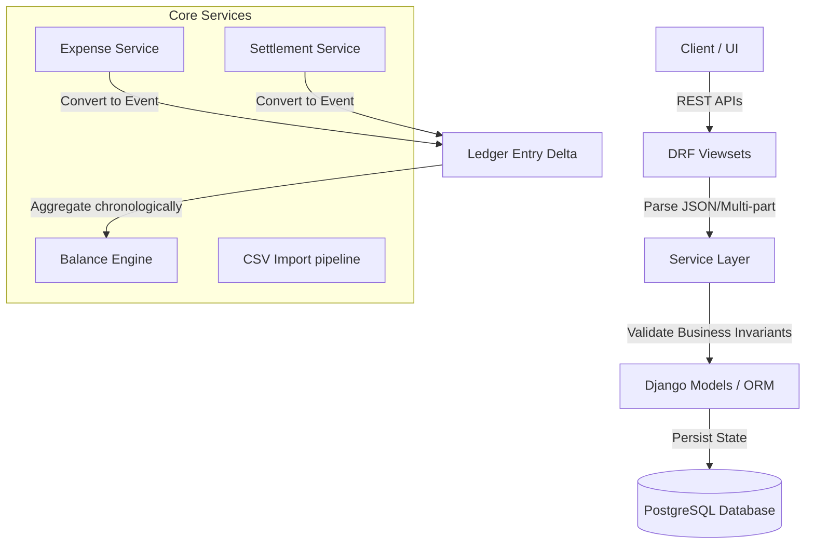

# Spreewise: Shared Expense Management System
## Documentation Portal & Developer Guide

---

## 1. Project Overview

**Spreewise** is an auditable, event-driven shared expense management system. Built with Django and PostgreSQL, it is designed for shared-living and group expense scenarios. Unlike standard expense splits, Spreewise treats transaction records and group memberships with strict historical validity, enforcing point-in-time membership validation and preserving immutable snapshots of all transaction state updates.

---

## 2. System Architecture



---

## 3. Technology Stack

* **Language**: Python 3.13
* **Backend Framework**: Django 6.0.6
* **API Layer**: Django REST Framework (DRF) 3.17.1
* **Database**: PostgreSQL
* **Security & Auth**: Django Session / Basic Authentication
* **Development Server**: Vite + React + TypeScript (Frontend)

---

## 4. Getting Started

### 4.1 Prerequisites
- Python 3.13
- PostgreSQL Database
- Node.js (for frontend Vite server)

### 4.2 Backend Setup
1. Navigate to the backend directory:
   ```bash
   cd shared-expense-app/backend
   ```
2. Activate the virtual environment:
   ```bash
   # Windows (PowerShell)
   venv\Scripts\Activate.ps1
   
   # Windows (CMD)
   venv\Scripts\activate.bat
   
   # Unix/macOS
   source venv/bin/activate
   ```
3. Install dependencies:
   ```bash
   pip install -r requirements.txt
   ```
4. Configure environment variables (see [Environment Variables](#5-environment-variables) below).
5. Apply database migrations:
   ```bash
   python manage.py migrate
   ```
6. Run the local development server:
   ```bash
   python manage.py runserver
   ```

### 4.3 Frontend Setup
1. Navigate to the frontend directory:
   ```bash
   cd shared-expense-app/frontend
   ```
2. Install npm packages:
   ```bash
   npm install
   ```
3. Run the frontend development server:
   ```bash
   npm run dev
   ```

---

## 5. Environment Variables

Create a `.env` file in the `shared-expense-app/backend/` directory with the following variables:

```ini
DB_NAME=spreewise
DB_USER=postgres
DB_PASSWORD=your_postgres_password
DB_HOST=localhost
DB_PORT=5432
```

---

## 6. API Overview

Spreewise provides REST APIs under `/api/`:

| URL | HTTP Method | Action |
|---|---|---|
| `/api/groups/` | `POST` | Create a new group |
| `/api/groups/{id}/members/` | `POST` | Add a member with a join date |
| `/api/groups/{id}/leave/` | `POST` | Deactivate membership with a leave date |
| `/api/expenses/` | `POST` | Log an expense (equal, percentage, shares, exact splits) |
| `/api/expenses/{id}/` | `PUT` | Edit expense, creating a new immutable snapshot version |
| `/api/settlements/` | `POST` | Record a peer-to-peer payment |
| `/api/balances/groups/{id}/` | `GET` | Fetch net balances for all members |
| `/api/balances/groups/{id}/simplified/` | `GET` | Fetch simplified transactions |
| `/api/imports/upload/` | `POST` | Ingest a CSV history file |
| `/api/imports/anomalies/{id}/decision/`| `POST` | Post a user decision on a flagged anomaly |

---

## 7. CSV Import Engine

The import engine allows users to upload a CSV file and validates it row-by-row using an anomaly catalog. If any `REVIEW_REQUIRED` anomaly is found, processing pauses:

1. **Upload**: User uploads file to `/api/imports/upload/`.
2. **Review**: Client queries `/api/imports/{id}/anomalies/` to retrieve the list of flagged rows.
3. **Decide**: User approves, rejects, or ignores anomalies via `/api/imports/anomalies/{id}/decision/`.
4. **Finalize**: Once all review anomalies are cleared, processing resumes, valid rows are saved as transactions, and a final `ImportReport` is generated.

---

## 8. Balance Engine Overview

The Balance Engine compiles net positions chronologically:
- **Ledger Invariant**: Computes delta arrays. Every transaction produces deltas that sum to exactly `0.00`.
- **Debt Simplification**: Net positions are extracted. The greedy algorithm sorts debtors and creditors, matching largest to largest, computing the minimum number of p2p transfers.
- **Explainability**: Returns chronological traces of how user balances evolved step-by-step.

---

## 9. Testing Instructions

To run tests in the backend, run:
```bash
# Ensure virtual environment is active
python manage.py test
```

Test cases in the verification suite validate:
- `ImportDecision` creation during review actions.
- Automatic linkage of imported expenses and settlements to their `ImportJob`.
- Anomaly category aggregation and report generation correctness.
