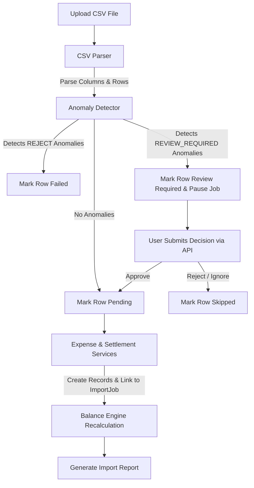

# SCOPE.md — Spreewise: Shared Expense Management System
## Project Scope Document

---

## 1. System Overview

**Spreewise** is a backend-first shared expense management application built with Django, PostgreSQL, and Django REST Framework. It is designed to handle all financial obligations arising from a shared-living or group-expense scenario with strict auditability, explainability, and historical correctness.

The system supports:
- Group creation and lifecycle management with membership date tracking
- Expense recording with multiple split types (equal, percentage, shares, exact)
- Settlement recording (peer-to-peer debt payments)
- A normalized Balance Engine that calculates net obligations from all events
- A CSV Import Engine that ingests historical data with full anomaly detection
- Immutable audit snapshots on every financial record
- Anomaly review decision audit history tracking

---

## 2. Implemented Priorities

| Priority | Module | Status |
|---|---|---|
| P1 | Infrastructure (Django, PostgreSQL, DRF, Auth) | ✅ Complete |
| P2 | Group Management & Membership Lifecycle | ✅ Complete |
| P3 | Expense Engine (all split types, snapshots, explainability) | ✅ Complete |
| P4 | Settlement Engine (payments, reference IDs, snapshots) | ✅ Complete |
| P5 | Balance Engine (ledger, simplification, explanation) | ✅ Complete |
| P6 | CSV Import Engine + Anomaly Detection | ✅ Complete |

---

## 3. Database Schema

The database consists of the following Django models:

### 3.1 Group (`groups.Group`)
Represents an expense group.
- `id` (Auto-increment Primary Key)
- `name` (CharField, max_length=255)
- `description` (TextField, optional)
- `currency` (CharField, max_length=10, default="INR")
- `is_archived` (BooleanField, default=False)
- `created_by` (ForeignKey to Django User, on_delete=PROTECT)
- `created_at` (DateTimeField, auto_now_add=True)
- `updated_at` (DateTimeField, auto_now=True)

### 3.2 GroupMembership (`groups.GroupMembership`)
Tracks users' non-contiguous active windows in a group.
- `id` (Auto-increment Primary Key)
- `group` (ForeignKey to Group, on_delete=CASCADE)
- `user` (ForeignKey to Django User, on_delete=PROTECT)
- `joined_at` (DateField)
- `left_at` (DateField, optional)
- `is_active` (BooleanField, default=True)
- `role` (CharField choices: owner, admin, member)
- `created_at` (DateTimeField, auto_now_add=True)
- *Constraints*: Unique active membership per user per group (`unique_active_group_membership`).

### 3.3 Expense (`expenses.Expense`)
Represents a financial expense shared among members.
- `id` (Auto-increment Primary Key)
- `group` (ForeignKey to Group, on_delete=PROTECT)
- `title` (CharField, max_length=255)
- `description` (TextField, optional)
- `amount` (DecimalField, max_digits=14, decimal_places=2)
- `currency` (CharField, max_length=10, default="INR")
- `original_amount` (DecimalField, max_digits=14, decimal_places=2)
- `original_currency` (CharField, max_length=10, default="INR")
- `expense_category` (CharField choices: food, rent, utilities, travel, groceries, entertainment, settlement, refund, general)
- `source` (CharField choices: manual, csv_import, system)
- `expense_date` (DateField)
- `paid_by` (ForeignKey to Django User, on_delete=PROTECT)
- `split_type` (CharField choices: equal, percentage, shares, exact)
- `status` (CharField choices: active, disputed, import_review)
- `notes` (TextField, optional)
- `import_job` (ForeignKey to ImportJob, on_delete=SET_NULL, optional)
- `created_by` (ForeignKey to Django User, on_delete=PROTECT)
- `created_at` (DateTimeField, auto_now_add=True)
- `updated_at` (DateTimeField, auto_now=True)
- `is_archived` (BooleanField, default=False)

### 3.4 ExpenseParticipant (`expenses.ExpenseParticipant`)
Tracks who was charged for a specific expense.
- `id` (Auto-increment Primary Key)
- `expense` (ForeignKey to Expense, on_delete=CASCADE)
- `user` (ForeignKey to Django User, on_delete=PROTECT)
- *Constraints*: Unique user-expense combination.

### 3.5 ExpenseSplit (`expenses.ExpenseSplit`)
Stores calculated and original split rules per participant.
- `id` (Auto-increment Primary Key)
- `expense` (ForeignKey to Expense, on_delete=CASCADE)
- `user` (ForeignKey to Django User, on_delete=PROTECT)
- `percentage_value` (DecimalField, optional)
- `shares_value` (DecimalField, optional)
- `exact_amount` (DecimalField, optional)
- `calculated_amount` (DecimalField, max_digits=14, decimal_places=2)
- *Constraints*: Unique user-expense combination.

### 3.6 ExpenseSnapshot (`expenses.ExpenseSnapshot`)
Stores immutable versions of expenses for audits.
- `id` (Auto-increment Primary Key)
- `expense` (ForeignKey to Expense, on_delete=CASCADE)
- `version` (IntegerField)
- `payload_json` (JSONField)
- `created_at` (DateTimeField, auto_now_add=True)
- *Constraints*: Unique combination of expense and version.

### 3.7 Settlement (`settlements.Settlement`)
Represents an direct p2p payment reducing debt.
- `id` (Auto-increment Primary Key)
- `reference_id` (CharField, max_length=50, unique=True)
- `group` (ForeignKey to Group, on_delete=PROTECT)
- `payer` (ForeignKey to Django User, on_delete=PROTECT)
- `receiver` (ForeignKey to Django User, on_delete=PROTECT)
- `amount` (DecimalField, max_digits=14, decimal_places=2)
- `currency` (CharField, max_length=10, default="INR")
- `original_amount` (DecimalField, max_digits=14, decimal_places=2)
- `original_currency` (CharField, max_length=10, default="INR")
- `payment_date` (DateField)
- `notes` (TextField, optional)
- `settlement_category` (CharField choices: direct_payment, bank_transfer, cash, upi, imported)
- `source` (CharField choices: manual, csv_import, system)
- `status` (CharField choices: active, disputed, import_review)
- `import_job` (ForeignKey to ImportJob, on_delete=SET_NULL, optional)
- `created_by` (ForeignKey to Django User, on_delete=PROTECT)
- `created_at` (DateTimeField, auto_now_add=True)
- `updated_at` (DateTimeField, auto_now=True)
- `is_archived` (BooleanField, default=False)

### 3.8 SettlementSnapshot (`settlements.SettlementSnapshot`)
Tracks immutable historical versions of settlements.
- `id` (Auto-increment Primary Key)
- `settlement` (ForeignKey to Settlement, on_delete=CASCADE)
- `version` (IntegerField)
- `payload_json` (JSONField)
- `created_at` (DateTimeField, auto_now_add=True)
- *Constraints*: Unique combination of settlement and version.

### 3.9 BalanceSnapshot (`balance_engine.BalanceSnapshot`)
Preserves group net balances at specific snapshots.
- `id` (Auto-increment Primary Key)
- `group` (ForeignKey to Group, on_delete=CASCADE)
- `snapshot_date` (DateTimeField, auto_now_add=True)
- `payload_json` (JSONField)
- `created_at` (DateTimeField, auto_now_add=True)

### 3.10 ImportJob (`imports.ImportJob`)
Manages bulk CSV file imports.
- `id` (Auto-increment Primary Key)
- `group` (ForeignKey to Group, on_delete=CASCADE, optional)
- `uploaded_by` (ForeignKey to Django User, on_delete=SET_NULL, optional)
- `original_filename` (CharField, max_length=255)
- `status` (CharField choices: pending, processing, review_required, completed, failed)
- `created_at` (DateTimeField, auto_now_add=True)
- `completed_at` (DateTimeField, optional)

### 3.11 ImportRow (`imports.ImportRow`)
Preserves details of individual CSV rows.
- `id` (Auto-increment Primary Key)
- `import_job` (ForeignKey to ImportJob, on_delete=CASCADE)
- `row_number` (IntegerField)
- `raw_data` (JSONField)
- `parsed_data` (JSONField, optional)
- `processing_status` (CharField choices: pending, imported, skipped, review_required, failed)

### 3.12 ImportAnomaly (`imports.ImportAnomaly`)
Represents an anomaly flagged on a row.
- `id` (Auto-increment Primary Key)
- `import_job` (ForeignKey to ImportJob, on_delete=CASCADE)
- `import_row` (ForeignKey to ImportRow, on_delete=CASCADE)
- `anomaly_type` (CharField, max_length=50)
- `anomaly_category` (CharField choices: duplicate, membership, currency, date, settlement, split, validation, unknown_user)
- `severity` (CharField choices: low, medium, high, critical)
- `description` (TextField)
- `detected_action` (CharField)
- `user_decision` (CharField, choices: approve, reject, ignore, optional)
- `created_at` (DateTimeField, auto_now_add=True)

### 3.13 ImportDecision (`imports.ImportDecision`)
Logs the audit trace of users review decisions.
- `id` (Auto-increment Primary Key)
- `anomaly` (OneToOneField to ImportAnomaly)
- `decision` (CharField choices: approve, reject, ignore)
- `decided_by` (ForeignKey to Django User, on_delete=SET_NULL, optional)
- `decision_reason` (TextField, optional)
- `created_at` (DateTimeField, auto_now_add=True)

### 3.14 ImportReport (`imports.ImportReport`)
Summary details of an completed/paused ImportJob.
- `id` (Auto-increment Primary Key)
- `import_job` (OneToOneField to ImportJob)
- `total_rows` (IntegerField, default=0)
- `imported_rows` (IntegerField, default=0)
- `skipped_rows` (IntegerField, default=0)
- `failed_rows` (IntegerField, default=0)
- `anomaly_count` (IntegerField, default=0)
- `report_json` (JSONField)

---

## 4. CSV Import Engine — Anomaly Detection Catalogue

Every anomaly rule flags a record in `ImportAnomaly` and operates under one of three policies:
- `REJECT`: Blocks processing. Row cannot be imported.
- `REVIEW_REQUIRED`: Pauses import. Demands user intervention.
- `AUTO_FIX`: System corrects the issue automatically.

### Implemented Anomaly Rules

#### A. Duplicate Expense
- **Anomaly Name**: `duplicate_expense`
- **Detection Logic**: Checks if an expense with the exact same description/title, amount, currency, payer, and expense_date already exists in the group (excluding archived ones).
- **Severity**: High
- **Policy**: `REVIEW_REQUIRED`

#### B. Duplicate Settlement
- **Anomaly Name**: `duplicate_settlement`
- **Detection Logic**: Checks if a settlement with the exact same payer, receiver, amount, currency, and payment_date already exists in the group (excluding archived ones).
- **Severity**: High
- **Policy**: `REVIEW_REQUIRED`

#### C. Negative Amount
- **Anomaly Name**: `negative_amount`
- **Detection Logic**: Flags if the parsed financial amount is less than `0.00`.
- **Severity**: High
- **Policy**: `REJECT`

#### D. Zero Amount
- **Anomaly Name**: `zero_amount`
- **Detection Logic**: Flags if the parsed financial amount is exactly `0.00`.
- **Severity**: Medium
- **Policy**: `REVIEW_REQUIRED`

#### E.1 Unknown Payer
- **Anomaly Name**: `unknown_user`
- **Detection Logic**: The username provided in the `payer` field does not exist in the database.
- **Severity**: Critical
- **Policy**: `REJECT`

#### E.2 Unknown Participant
- **Anomaly Name**: `unknown_participant`
- **Detection Logic**: One or more usernames listed in the `participants` column do not exist in the database.
- **Severity**: Critical
- **Policy**: `REJECT`

#### F. Invalid Date
- **Anomaly Name**: `invalid_date`
- **Detection Logic**: The date field is empty, malformed, or doesn't match standard formats (`YYYY-MM-DD`, `DD/MM/YYYY`, `MM/DD/YYYY`, `DD-MM-YYYY`, `YYYY/MM/DD`).
- **Severity**: High
- **Policy**: `REJECT`

#### G. Unsupported Currency
- **Anomaly Name**: `unsupported_currency`
- **Detection Logic**: The currency code is not in the supported list: `{"INR", "USD", "EUR", "GBP"}`.
- **Severity**: High
- **Policy**: `REJECT`

#### H.1 Missing Required Fields
- **Anomaly Name**: `missing_required_fields`
- **Detection Logic**: One or more required CSV columns (`date`, `description`, `payer`, `amount`, `currency`, `participants`, `split_type`) are missing or unparseable.
- **Severity**: High
- **Policy**: `REJECT`

#### H.2 Missing Payer
- **Anomaly Name**: `missing_payer`
- **Detection Logic**: The `payer` field is blank or missing.
- **Severity**: Critical
- **Policy**: `REJECT`

#### I.1 Payer Not Active on Date
- **Anomaly Name**: `payer_not_active_on_date`
- **Detection Logic**: The payer was not an active group member on the expense date (validated using `is_member_on_date()`).
- **Severity**: High
- **Policy**: `REJECT`

#### I.2 Participant Not Active on Date
- **Anomaly Name**: `participant_not_active_on_date`
- **Detection Logic**: One or more participants were not active group members on the expense date (validated using `is_member_on_date()`).
- **Severity**: High
- **Policy**: `REJECT`

#### J. Settlement Logged as Expense
- **Anomaly Name**: `settlement_logged_as_expense`
- **Detection Logic**: The expense description contains one or more settlement keywords: `paid back`, `reimbursement`, `reimburse`, `payback`, `pay back`, `settled`, `settlement`, `transfer`, `repaid`, `repay`.
- **Severity**: High
- **Policy**: `REVIEW_REQUIRED`

#### K. Currency Conversion Required
- **Anomaly Name**: `currency_conversion_required`
- **Detection Logic**: The currency of the row differs from the default currency configured for the group.
- **Severity**: Medium
- **Policy**: `REVIEW_REQUIRED`

#### L. Split Validation Failure
- **Anomaly Name**: `split_validation_failure`
- **Detection Logic**: Split type is non-equal (`percentage`, `shares`, `exact`) but the `splits_data` column is blank or unparseable.
- **Severity**: High
- **Policy**: `REJECT`

---

## 5. Import Pipeline

The import processing workflow operates as follows:

1. **Parser**: Normalizes CSV headers, parses fields into types, and identifies formatting errors.
2. **Anomaly Detector**: Scans rows for rules A–L.
3. **Review Workflow**: If `REVIEW_REQUIRED` anomalies exist, the job changes to `review_required` and stops. Decisions must be posted to `/api/imports/anomalies/{id}/decision/`.
4. **Execution**: Safe rows (and approved rows) are processed. Expense or Settlement objects are generated via transaction-safe service layers.
5. **Ledger & Balances**: Post-import completion triggers balance recalculation.
